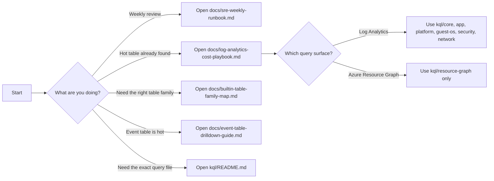

# Log Analytics Cost Triage Pack

Use this repo to identify ingestion-cost problems in Azure Monitor Logs, drill into noisy built-in tables, and hand findings to SRE, platform, or app teams.

## Start Here
- Weekly SRE review: [docs/sre-weekly-runbook.md](/Users/loredan/Downloads/GeneralCrap/docs/sre-weekly-runbook.md)
- Full investigation flow: [docs/log-analytics-cost-playbook.md](/Users/loredan/Downloads/GeneralCrap/docs/log-analytics-cost-playbook.md)
- `Event` table deep dive: [docs/event-table-drilldown-guide.md](/Users/loredan/Downloads/GeneralCrap/docs/event-table-drilldown-guide.md)
- Unknown built-in table: [docs/builtin-table-family-map.md](/Users/loredan/Downloads/GeneralCrap/docs/builtin-table-family-map.md)
- Official Microsoft source map: [docs/microsoft-learn-reference-map.md](/Users/loredan/Downloads/GeneralCrap/docs/microsoft-learn-reference-map.md)
- Query library map: [kql/README.md](/Users/loredan/Downloads/GeneralCrap/kql/README.md)
- Documentation index: [docs/README.md](/Users/loredan/Downloads/GeneralCrap/docs/README.md)

## Decision Flow

## Fast Paths
### Weekly Review
1. Run [04_active_table_inventory.kql](/Users/loredan/Downloads/GeneralCrap/kql/core/04_active_table_inventory.kql)
2. Run [00_workspace_usage_by_table.kql](/Users/loredan/Downloads/GeneralCrap/kql/core/00_workspace_usage_by_table.kql)
3. Run [05_weekly_ingestion_anomalies_by_table.kql](/Users/loredan/Downloads/GeneralCrap/kql/core/05_weekly_ingestion_anomalies_by_table.kql)
4. Record findings in [weekly-review-template.md](/Users/loredan/Downloads/GeneralCrap/docs/weekly-review-template.md)

### Hot Table Investigation
1. Start with [log-analytics-cost-playbook.md](/Users/loredan/Downloads/GeneralCrap/docs/log-analytics-cost-playbook.md)
2. If the table is unfamiliar, use [builtin-table-family-map.md](/Users/loredan/Downloads/GeneralCrap/docs/builtin-table-family-map.md)
3. If needed, use [31_builtin_table_shape_probe.kql](/Users/loredan/Downloads/GeneralCrap/kql/generic/31_builtin_table_shape_probe.kql) before adapting a drill-down

### Event Table Investigation
1. [21_event_breakdown.kql](/Users/loredan/Downloads/GeneralCrap/kql/guest-os/21_event_breakdown.kql)
2. [40_event_log_level_mix.kql](/Users/loredan/Downloads/GeneralCrap/kql/guest-os/40_event_log_level_mix.kql)
3. [38_event_hosts_by_volume.kql](/Users/loredan/Downloads/GeneralCrap/kql/guest-os/38_event_hosts_by_volume.kql)
4. [39_event_id_source_matrix.kql](/Users/loredan/Downloads/GeneralCrap/kql/guest-os/39_event_id_source_matrix.kql) or [35_event_source_breakdown.kql](/Users/loredan/Downloads/GeneralCrap/kql/guest-os/35_event_source_breakdown.kql)
5. [37_event_trend_by_id.kql](/Users/loredan/Downloads/GeneralCrap/kql/guest-os/37_event_trend_by_id.kql) or [44_event_spikes_by_signature_vs_baseline.kql](/Users/loredan/Downloads/GeneralCrap/kql/guest-os/44_event_spikes_by_signature_vs_baseline.kql)
6. [36_event_repeated_descriptions.kql](/Users/loredan/Downloads/GeneralCrap/kql/guest-os/36_event_repeated_descriptions.kql)
7. [41_event_payload_outliers.kql](/Users/loredan/Downloads/GeneralCrap/kql/guest-os/41_event_payload_outliers.kql) if record size looks suspicious
8. [46_event_security_log_breakdown.kql](/Users/loredan/Downloads/GeneralCrap/kql/guest-os/46_event_security_log_breakdown.kql) if Security events are landing in `Event`
9. [42_event_low_severity_tuning_candidates.kql](/Users/loredan/Downloads/GeneralCrap/kql/guest-os/42_event_low_severity_tuning_candidates.kql) for collection-tuning discussions

## Surfaces
- Log Analytics queries live under [kql](/Users/loredan/Downloads/GeneralCrap/kql)
- Azure Resource Graph queries live under [kql/resource-graph](/Users/loredan/Downloads/GeneralCrap/kql/resource-graph)
- If `Resources`, `PolicyResources`, `AdvisorResources`, or `resourcechanges` fails to resolve, the query was run in Log Analytics instead of Azure Resource Graph
